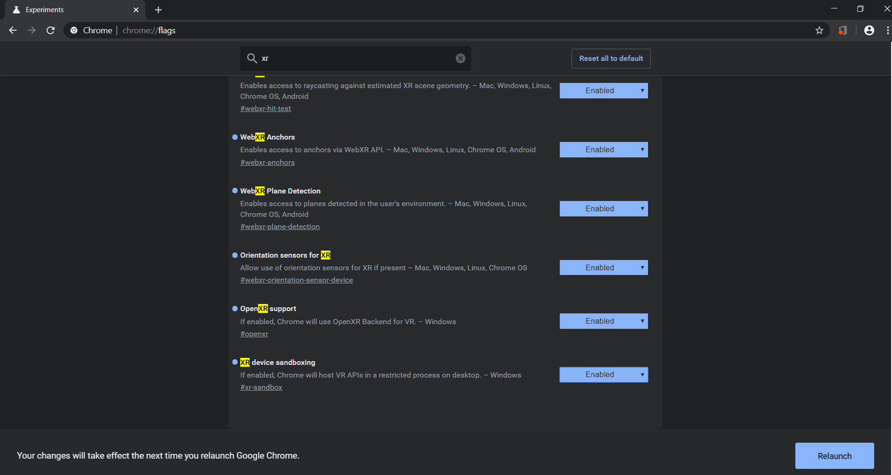

# MixedRealityResources

  
- Short Link: [bit.ly/mixedrealityresources](https://bit.ly/mixedrealityresources)
- XR Developer YouTube Channel: [www.youtube.com/c/XRDeveloper](https://www.youtube.com/c/xrdeveloper)
- WebXR YouTube Channel: [bit.ly/WebXRYoutube](https://www.youtube.com/channel/UCNzjXKJVyqYVyPY8rGKwFtQ)

Collection of Mixed Reality related resources, inspirations. Please ask on [LearnXR Reddit](https://www.reddit.com/r/LearnXR/) or  file an issue, if you are looking for a resource that is not listed or if you have suggestions or additions. Hope it is helps you to learn and create. 

- [Design](#design)
  - [Guidelines](#guidelines)
  - [Assets](#assets)
  - [Blogs](#blogs)
  - [Talks](#talks)
  - [Tools](#tools)
- [Develop](#develop)
  - [Documentation](#documentation)
  - [Developer Tools](#developer-tools)
  - [Repositories](#repositories)
  - [WebXR](#webxr)
    - [WebXR Documentation](#webxr-documentation)
    - [WebXR Examples](#webxr-examples)
    - [WebXR Libraries](#webxr-libraries)
    - [WebXR Repositories](#webxr-repositories)
  - [Mobile Native](#mobile-native)
    - [Documentation](#documentation)
    - [Libraries](#libraries)
    - [Repositories](#repositories)
  - [Tutorials](#tutorials)
  - [Talks](#talks)
  - [Media/Newsletter](#media/newsletter)
- [Create](#create)
  - [Asset Creation Tools](#asset-creation-tools)
  - [Asset Creation Libraries](#asset-libraries)
  - [Inspirations](#inspirations)
- [Attend](#attend)
  - [Conferences](#conferences)
  - [Meet](#meet)
    - [San Francisco](#san-francisco)
  - [Hackathons](#hackathons)
- [Read](#read)
  - [Newsletters](#newsletters)
  - [Blogs](#blogs-1)
  - [Books](#books)
- [Watch](#watch)
- [Join](#join)
- [Concepts and FAQ](#concepts-and-faq)

## Design

### Guidelines

- [Microsoft Mixed Reality Design](https://docs.microsoft.com/windows/mixed-reality/design?WT.mc_id=mixedrealityresources-github-ayyonet)
  

- [Mixed Reality Interaction Fundamentals](https://docs.microsoft.com/windows/mixed-reality/interaction-fundamentals?WT.mc_id=mixedrealityresources-github-ayyonet)
- [Designing Holograms App for HoloLens](https://www.microsoft.com/en-us/p/designing-holograms/9nxwnjklrzwd?rtc=2&WT.mc_id=spatial-0000-ayyonet)
- [Google AR Design Guidelines](https://designguidelines.withgoogle.com/ar-design/augmented-reality-design-guidelines/introduction.html)
- [Unity VR Best Practices](https://learn.unity.com/tutorial/vr-best-practice#)

### Assets

- [Smithsonian Museum 3D Scan Collection](https://3d.si.edu/)
- [MorphoSource by Duke University](https://www.morphosource.org/)
- [GB3D Type Fossils](http://www.3d-fossils.ac.uk/search.cfm?pageNo=1&sortCol=REG_NUMBER&sortDir=ASC&taxonGroup=&genus=&species=&typeStatus=any&geoAge=any&rockUnit=&locality=&country=any&institution=any&regNo=&scans=on&advSubBtn=Search)
- [Nasa 3D Resources](https://nasa3d.arc.nasa.gov/)
- [Protein Data Bank](http://www.rcsb.org/pdb/results/results.do?tabtoshow=Current&qrid=E3107058)
- [Poly](https://poly.google.com/)
- [Kronos glTF Sample Models](https://github.com/KhronosGroup/glTF-Sample-Models)
- [Unity Asset Store](https://assetstore.unity.com/)
- [Open Game Art](https://opengameart.org/)
- [Sketchfab](https://sketchfab.com/tags/library)
- [TurboSquid](https://www.turbosquid.com/Search/3D-Models)
- [Hum3D](https://hum3d.com/)
- [Design Connected](https://www.designconnected.com/catalog/3D-Models/all)
- [Autodesk Gallery](https://gallery.autodesk.com/)
- [GrabCad](https://grabcad.com/library)
- [3D Warehouse](https://3dwarehouse.sketchup.com/?hl=en)
- [3D Content Central](https://www.3dcontentcentral.com/)
- [Trace Parts](https://www.traceparts.com/)
- [Thingsverse](https://www.thingiverse.com/)
- [Clara.io](https://clara.io/library)
- [CG Trader](https://www.cgtrader.com/3d-models/library)
- [Free3D](https://free3d.com/3d-models/library)
- [3D Export](https://3dexport.com/free-3d-models)
- [Bibliocad](https://www.bibliocad.com/en/)
- [Thinkercad](https://www.tinkercad.com/things)
- [3Dmdb](https://3dmdb.com/)
- [3D Model Free](http://www.3dmodelfree.com/)
- [Flying Architecture](https://flyingarchitecture.com/)
- [RenderPeople](https://renderpeople.com/3d-posed-people/)
- [3D Headscans](https://3dheadscans.com/)
- [VizPeople](https://www.viz-people.com/product-category/3d-models/?sidebar=no-sidebar)
- [Evermotion](https://evermotion.org/downloads)
- [Archive 3D](https://archive3d.net/)
- [CadNav](http://www.cadnav.com/3d-models/)
- [Blend Swap](https://www.blendswap.com/)
- [STL Finder](https://www.stlfinder.com/)
- [Orchard Crowdsource Design](https://3dorchard.com/)
- [Human Alloy](https://humanalloy.com/shop/)
- [PinShape](https://pinshape.com/)
- [3Dsky](https://3dsky.org/)
- [ShareCG](https://www.sharecg.com/b/5/3DModels)
- [PixelLab](https://www.thepixellab.net/freebies)
- [3D Scan Store](https://www.3dscanstore.com/)
- [Syncronia](https://www.syncronia.com/en)
- [Dimensiva](https://dimensiva.com/)
- [3Delicious](https://3delicious.net/)
- [Bitgem 3D](https://shop.bitgem3d.com/collections/on-sale)
- [Play Canvas curated assets](https://github.com/playcanvas/awesome-playcanvas)
- [List of common 3D Test models](https://en.wikipedia.org/wiki/List_of_common_3D_test_models)

### Blogs

- [Mozilla Blog - Progressive WebXR Store](https://blog.mozvr.com/progressive-webxr-ar-store/) 
  
 
- [Human factor in virtual reality data visualization](https://medium.com/inborn-experience/vr-dataviz-41ef0dc879c)
- [Getting Hands-On with Responsive AR](https://www.torch.app/blog/getting-hands-on-with-responsive-ar)
- [All3DP](https://all3dp.com/)
- [How to Design User Interfaces for Oculus Quest Hand Tracking Applications](https://circuitstream.com/blog/oculus-quest-hand-tracking/)

### Talks

- [Monika Bielskyte @ Microsoft Design Day](https://t.co/2KrhpfG42C?amp=1)
- [Instructional Design on the Immersive Web](https://youtu.be/ZX_8fiW1_Y4?t=220)

### Tools

- [Unity3D](https://unity.com/)
- [Unreal Engine](https://www.unrealengine.com/en-US/what-is-unreal-engine-4)
- [Maquette](https://www.maquette.ms/?WT.mc_id=mixedrealityresources-github-ayyonet)
- [Play Canvas](https://playcanvas.com/)
- [Amazon Sumerian](https://aws.amazon.com/sumerian/)
- [Remix 3D](https://www.remix3d.com/discover?section=34b78f58881242e4ab611e4ab5ffaa78?WT.mc_id=mixedrealityresources-github-ayyonet)
- [Autodesk Maya](https://www.autodesk.com/products/maya/overview)
- [Apple Reality Composer](https://developer.apple.com/documentation/realitykit/creating_a_game_with_reality_composer)
- [Voxel Plugin for Unreal](https://voxelplugin.com/)
- [PotassiumES: A lovely wider web app framework](https://potassiumes.org/)
- [Quill VR Animation Tool for Oculus Rift](https://quill.fb.com/)
- [RapidCompact Asset Optimization Platform](https://rapidcompact.com/)

## Develop

### Documentation

- [Microsoft Mixed Reality](https://docs.microsoft.com/windows/mixed-reality/development?WT.mc_id=mixedrealityresources-github-ayyonet)
- [Mozilla Mixed Reality](https://mixedreality.mozilla.org/)
- [Google Developers WebXR](https://developers.google.com/web/fundamentals/vr/status/#xrdevice)
- [ARCore - Android](https://developers.google.com/ar/)
- [ARKit - IOS](https://developer.apple.com/augmented-reality/)

### Developer Tools

- [Unity3D](https://unity.com/)
- [Unreal Engine](http://bit.ly/HoloLensUnrealDev)
- [Apple RealityKit](https://developer.apple.com/documentation/realitykit)
- [WebVR API Emulation - Chrome Extention](https://chrome.google.com/webstore/detail/webvr-api-emulation/gbdnpaebafagioggnhkacnaaahpiefil?hl=en)
- [VR Viewer Chrome Extention](https://chrome.google.com/webstore/detail/vr-viewer/fagmjpknkfadjnehfkgkkbjnjpnnpcic?hl=en)
- [ThreeJS Dev Tools](https://github.com/threejs/three-devtools)
- [WebXR API Emulator Chrome Extention](https://chrome.google.com/webstore/detail/webxr-api-emulator/mjddjgeghkdijejnciaefnkjmkafnnje)

 
 
 - [StereoKit](https://playdeck.net/blog/introducing-stereokit?WT.mc_id=mixedrealityresources-github-ayyonet)
 
 
 
 - [Mixed Reality World Locking Tools for Unity3D](https://microsoft.github.io/MixedReality-WorldLockingTools-Unity/README.html)

### Repositories

- [MixedRealityToolkit-Unity](https://github.com/microsoft/MixedRealityToolkit-Unity?WT.mc_id=mixedrealityresources-github-ayyonet)
- [MapsSDK-Unity](https://github.com/microsoft/MapsSDK-Unity?WT.mc_id=mixedrealityresources-github-ayyonet)

|  |  |  |
| :------------------------------------------------------------------------------------- | :---------------------------------------------------------------------------------- | :--------------------------------------------------------------------------------- |

- [Google-AR](https://github.com/google-ar)
- [Mixed Reality Toolkit Demos](https://github.com/microsoft/MixedRealityToolkit-Unity/tree/mrtk_release/Assets/MixedRealityToolkit.Examples/Demos?WT.mc_id=mixedrealityresources-github-ayyonet)
- [Enklu Player](https://github.com/enklu/enklu-samples)
- [Tutorials and Samples](https://docs.microsoft.com/windows/mixed-reality/tutorials?WT.mc_id=mixedrealityresources-github-ayyonet)
- [Unity AR Foundation Examples](https://github.com/Unity-Technologies/arfoundation-samples)

### SDKs

- [Azure Spatial Anchors for Unreal Engine](https://docs.microsoft.com/en-us/windows/mixed-reality/unreal-azure-spatial-anchors?WT.mc_id=docs-github-ayyonet&WT.mc_id=github-twitchings-ayyonet)
- [Scene Understanding SDK for Mixed Reality](https://docs.microsoft.com/windows/mixed-reality/scene-understanding-sdk?WT.mc_id=docs-github-ayyonet)
- [MapsSDK-Unity](https://github.com/microsoft/MapsSDK-Unity?WT.mc_id=mixedrealityresources-github-ayyonet)

### WebXR

Check out the current browser support for WebXR at [CanIUse.com](https://caniuse.com/#search=webxr).

#### WebXR Documentation

- [Immersive/web.dev](https://immersiveweb.dev/)
- [Microsoft WebVR docs](https://docs.microsoft.com/windows/mixed-reality/using-webvr-in-edge-with-windows-mixed-reality?WT.mc_id=mixedrealityresources-github-ayyonet)
- [Mozilla WebXR Blog](https://blog.mozvr.com/tag/webxr/)
- [Google WebXR Updates](https://developers.google.com/web/updates/tags/webxr)
- [Google WebXR Device API docs](https://developers.google.com/web/fundamentals/vr/status/#xrdevice)
- [BabylonJS Docs Samples](https://doc.babylonjs.com/examples/?WT.mc_id=mixedrealityresources-github-ayyonet)
- [ThreeJS VR Content](https://threejs.org/docs/index.html#manual/en/introduction/How-to-create-VR-content)
- [WebVR Rocks](https://webvr.rocks/)
- [W3C WebXR Device API](https://www.w3.org/TR/webxr/)
- [A-Frame Docs](https://aframe.io/docs/0.9.0/introduction/)
- [Augmented Reality with Model-Viewer Web Component](https://developers.google.com/web/updates/2019/05/model-viewer-ar)
- [PSA: State of WebXR](https://docs.google.com/document/d/1R8Bz0_vK9YmY5-ZhsbLtZ9-DDJpTOgNeibFD4SdUnbw/edit#heading=h.yrc5sgqnnsk3)
- [CreateWebXR.com](https://createwebxr.com/webVR.html)

#### WebXR Tutorials

 - [WebXR Tutorials YouTube Playlist](https://www.youtube.com/channel/UCNzjXKJVyqYVyPY8rGKwFtQ/playlists?view=50&sort=dd&shelf_id=2&view_as=subscriber)
 - [Mozilla Labs Learn](https://labs.mozilla.org/learn/)
 
#### WebXR Examples

- [Immersive Web WebXR Samples](https://immersive-web.github.io/webxr-samples/)
- [ImmersiveWeb.dev Demos](https://immersiveweb.dev/#tryoutsomedemos)
- [Servo Firefox Examples](https://servo.org/hl-home/)
- [WebXR AR plane detection and Anchors](https://storage.googleapis.com/chromium-webxr-test/r695783/proposals/phone-ar-plane-detection-anchors.html)
Note: WebXR Anchors experimental flag needs to be enabled to see this example. 
 

#### WebXR Libraries

- [Unity WebXR Exporter](https://github.com/MozillaReality/unity-webxr-export)

- [BabylonJS](https://github.com/BabylonJS?WT.mc_id=mixedrealityresources-github-ayyonet)
- [ThreeJS](https://threejs.org/)
- [A-frame](https://aframe.io/): Make WebVR with HTML and Entity-Component. Works on Vive, Rift, Daydream, GearVR, desktop.
- [AR.js](https://github.com/jeromeetienne/AR.js): AR.js uses artoolkit, and so it is marker based. artoolkit is a software with years of experience doing augmented reality. It is able to do a lot!
  
- [ARSuite](https://arsuite.com/technology)
- [Inverse kinematics for three.js](https://github.com/jsantell/THREE.IK)
- [Three.ar.js](https://github.com/google-ar/three.ar.js)
- [Exokit Native Engine](https://github.com/exokitxr/exokit)
- [Viro](https://viromedia.com/)
- [XR Chat](https://github.com/xrchat)
- [ARnft](https://github.com/kalwalt/ARnft)
- [Handy.js](https://github.com/stewdio/handy.js)

 

#### WebXR Repositories

- [WebXR Polyfills](https://github.com/immersive-web/webxr-polyfill)
- [ThreeJS WebVR Examples](https://threejs.org/examples/?q=vr)
- [WebXR Samples](https://immersive-web.github.io/webxr-samples/)
- [GoogleWebComponents/model-viewer](https://github.com/GoogleWebComponents/model-viewer)
- [Chrome Platform Status Samples](https://www.chromestatus.com/samples#webxr)
- [ThreeJS Dev Tools](https://github.com/threejs/three-devtools)
- [Poly Historical Models](https://poly.google.com/user/4U4FhbhDQdR)

### Mobile Native

#### Documentation

#### Libraries

- [Unity3D](https://unity.com/unity/features/ar)
- [Unreal Engine](https://www.unrealengine.com/en-US/vr)
- [NativeScript AR](https://github.com/EddyVerbruggen/nativescript-ar)
- [Viro React](https://viromedia.com/viroreact/)

 
- [Exokit](https://exokit.org/)
- [Babylon Native](https://github.com/BabylonJS/BabylonNative)
- [Amazon Sumerian](https://aws.amazon.com/sumerian/)

#### Repositories

### Tutorials

- [Unity Mixed Reality Lessons](aka.ms/MixedRealityCurriculum)
- [Microsoft Mixed Reality Tutorials](https://docs.microsoft.com/windows/mixed-reality/tutorials?WT.mc_id=mixedrealityresources-github-ayyonet)
- [Azure Spatial Anchors](https://t.co/YuVZeZmhSN?amp=1)
- [Google Developer Codelabs](https://codelabs.developers.google.com/?cat=Augmented+Reality)
- [WebVR Starter Kit](https://hacks.mozilla.org/2019/02/webvr-starter-kit-mozilla-glitch/)
- [3D Projection Notes](https://jsantell.com/notes)

### Talks

- [Intro to Building Apps for HoloLens 2 Using Unity and Mixed Reality Toolkit](https://mybuild.techcommunity.microsoft.com/sessions/77094?source=sessions#top-anchor&WT.mc_id==mixedrealityresources-github-ayyonet)
- [Developing Mobile Augmented Reality (AR) Applications with Azure Spatial Anchors](https://mybuild.techcommunity.microsoft.com/sessions/77246?source=sessions&WT.mc_id==mixedrealityresources-github-ayyonet#top-anchor)
- [Exploring Augmented Reality on the Web - JSConfEU 2018](https://www.youtube.com/watch?v=bqmT0_w6_qc)

### Media/Newsletter

- [Immersive Web Weekly](https://immersivewebweekly.com/)
- [Voices of VR Podcast](https://voicesofvr.com/)
- [VRScout Podcast](https://vrscout.com/podcast/)
- [The AR Show Podcast](https://www.stitcher.com/podcast/the-ar-show/ar-show?refid=stpr)
- [Veer VR Blog](https://veer.tv/blog/)
- [Next Reality News](https://next.reality.news/)

## Create

### Asset Creation Tools

- [Magic Voxel](https://ephtracy.github.io/index.html?page=mv_main)
- [Voxel.js](http://voxeljs.com/#what)
- [Unity3D](https://unity.com/)
- [Unreal Engine](https://www.unrealengine.com/en-US/what-is-unreal-engine-4)
- [Maquette](https://www.maquette.ms/?WT.mc_id=mixedrealityresources-github-ayyonet)
- [Play Canvas](https://playcanvas.com/)
- [Amazon Sumerian](https://aws.amazon.com/sumerian/)
- [Remix 3D](https://www.remix3d.com/discover?section=34b78f58881242e4ab611e4ab5ffaa78?WT.mc_id=mixedrealityresources-github-ayyonet)
- [Autodesk Maya](https://www.autodesk.com/products/maya/overview)
- [Spoke by Mozilla](https://hubs.mozilla.com/spoke)

### Asset Libraries

- [Poly](https://poly.google.com/)
- [Sketchfab](https://sketchfab.com/)
- [Unity 3D Asset Store](https://assetstore.unity.com/3d)
- [TurboSquid](https://www.turbosquid.com/)
- [3D Trader](https://www.cgtrader.com/3d-models)

### Inspirations

- [Google WebVR Experiments](https://experiments.withgoogle.com/collection/webvr)
- [Google AR Experiments](https://experiments.withgoogle.com/collection/ar)
- [Babylon.js Demos](https://www.babylonjs.com/community/?WT.mc_id=mixedrealityresources-github-ayyonet)
- [ThreeJS Examples](https://threejs.org/)
- [3D Artist Online](https://www.3dartistonline.com/)
- [SF Moma movement controlled experience](https://www.frogdesign.com/work/sf-moma)
- [Google Augmented Reality museum experience](https://youtu.be/ASWqxIgR4L8)
- [MoMa Jackson Pollack](https://archinect.com/news/article/150061965/an-augmented-reality-art-exhibit-hijacks-moma-s-jackson-pollock-gallery)

## Attend

### Conferences

- [Augmented World Expo](https://www.awexr.com/) - USA, Europe
- [AR/VR Global Summit](https://www.vrarglobalsummit.com/)
- [VRX Conference and Expo](https://events.vr-intelligence.com/vrx/)
- [University of Washington XR Day](https://www.hcde.washington.edu/xr-day)

### Meet

#### Online

- [Mozilla Hubs](https://hubs.mozilla.com/)
- [Windows AltSpace VR](https://altvr.com/)
- [Facebook Spaces](https://www.facebook.com/spaces)
- [myxr.social](https://myxr.social/)

#### San Francisco

- [Microsoft Mixed Reality Events Calendar](http://bit.ly/SFMixedRealityEvents)
- [WebXR Meetup](https://www.meetup.com/Web-VR/)
- [HoloLens and Mixed Reality Meetup](https://www.meetup.com/hololens-mr/members/?sort=join_date&desc=true)
- [SF Augmented Reality Meetups](https://www.meetup.com/topics/augmented-reality/us/ca/san_francisco/)
- [SF Mixed Reality Meetups](https://www.meetup.com/topics/augmented-mixed-reality/us/ca/san_francisco/)

### Hackathons

 - [MIT Reality Hack](https://www.mitrealityhack.com/)

## Read 

### Newsletters

- [Mozilla WebVR Newsletter](https://mail.mozilla.org/listinfo/web-vr-discuss)
- [Augmented World Expo Newsletter](https://augmentedworldexpo.us4.list-manage.com/subscribe?u=d9a1ebb835d4cf32081bc4aca&id=e2fc180d36)
- [Immersive Web Weekly](https://immersivewebweekly.com/)
- [AR Insider Weekly](https://visitor.r20.constantcontact.com/manage/optin?v=001cPYbv-_gtYvZ2HEbuKDsvV8PPVDHsr-vtIA-1S2FPCmdC4B-BxvXbEnk81JYICJuolrDwlBMorj76oIBVPTqihVonMPLKKhyajQijZHRPo7xjwj3Dn0fIBA0hna22CzZjkDqtO33CpV9y0oER_m8Og%3D%3D)

### Blogs

- [Custom elements for the immersive web](https://blog.mozvr.com/custom-elements-for-the-immersive-web/)
|  |
- [Mozilla Blog - Progressive WebXR Store](https://blog.mozvr.com/progressive-webxr-ar-store/)
- [Human factor in virtual reality data visualization](https://medium.com/inborn-experience/vr-dataviz-41ef0dc879c)
- [Getting Hands-On with Responsive AR](https://www.torch.app/blog/getting-hands-on-with-responsive-ar)

### Books

- [Learning Virtual Reality - Tony Parisi](https://www.oreilly.com/library/view/learning-virtual-reality/9781491922828/)
- [Programming 3D Applications with HTML5 and WebGL: 3D Animation and Visualization for Web Pages Tony Parisi](https://books.google.com/books/about/Programming_3D_Applications_with_HTML5_a.html?id=UvrYAgAAQBAJ)
- [Envisioning Holograms: Design Breakthrough Experiences for Mixed Reality](https://smile.amazon.com/dp/1484227484/ref=cm_sw_em_r_mt_dp_U_vDDvDbGAW9BPZ)
- [Creating Augmented and Virtual Realities](https://www.oreilly.com/library/view/creating-augmented-and/9781492044185/)

## Watch

- [GDC Vault](https://www.gdcvault.com/)
- [WebXR Youtube Channel](https://www.youtube.com/channel/UCNzjXKJVyqYVyPY8rGKwFtQ?view_as=subscriber)
- [XR Developer](https://www.youtube.com/channel/UC8ohQvrBXGvEvP_9X98r4bQ)
- [Microsoft HoloLens Youtube](https://www.youtube.com/channel/UCT2rZIAL-zNqeK1OmLLUa6g)
- [Google ARCore Youtube](https://www.youtube.com/channel/UCqC91zLfMrEyb69vdDfYV8Q)
- [Made with ARKit](https://www.youtube.com/channel/UCW4PVyHZJnfzHZjws9xDQtw)
- [Apple AR/VR Sessions](https://developer.apple.com/videos/graphics-and-games/ar-vr)

## Join

### Online Communities

- [Immersive Web Community Group](https://www.w3.org/community/immersive-web/)
- [Open AR Cloud](https://www.openarcloud.org/)
- [HoloLens Developer Slack Channel](https://holodevelopers.slack.com)
- [WebVR Slack Channel](https://webvr-slack.herokuapp.com/)
- [LearnXR Reddit](https://www.reddit.com/r/LearnXR/)
- [AFrame Communities](https://aframe.io/community/)
- [ARKit Apple Developer Forum](https://forums.developer.apple.com/community/graphics-and-games/arkit)
- [Augmented Reality Reddit](https://www.reddit.com/r/augmentedreality/)
- [WindowsMR Reddit](https://www.reddit.com/r/WindowsMR/)
- [Windows Mixed Reality Reddit](https://www.reddit.com/r/WindowsMR/)
- [Mozilla Hubs](https://hubs.mozilla.com/)
- [Catchar.io](https://catchar.io/)
- [FrameVR Virtual Classroom and Meetings](https://framevr.io/)
- [Virtual Reality Gaming Reddit](https://www.reddit.com/r/VRGaming/)
- [AR MR XR Reddit](https://www.reddit.com/r/AR_MR_XR/)
- [Mixed Reality Reddit](https://www.reddit.com/r/mixedreality/)
- [Magic Leap Reddit](https://www.reddit.com/r/magicleap/)
- [ARCoreCreators Reddit](https://www.reddit.com/r/ARCoreCreators/)
- [ARCore Reddit](https://www.reddit.com/r/Arcore/)
- [WebXR Reddit](https://www.reddit.com/r/WebXR/)

## Concepts and FAQ

- [What are some use cases and case studies for Mixed Reality applications?](./faq.md#where-can-i-find-case-studies-for-mixed-reality-applications)
  - [Medical](./faq.md#medical)
  - [Educational](./faq.md#educational)
  - [Museums and Libraries](./faq.md#museums-and-libraries)
  - [Entertainment](./faq.md#entertainment)
  - [Web 3D](https://www.web3d.org/case-studies)
- [What is Mixed Reality/ Augmented Reality/ Virtual Reality?](https://docs.microsoft.com/windows/mixed-reality/mixed-reality?WT.mc_id=mixedrealityresources-github-ayyonet)
- [How do you decide if VR or AR is the right choice for your application?](https://twitter.com/WindowsDocs/status/1182311208529121280)
- [What is an Anchor?](https://github.com/immersive-web/anchors/blob/master/explainer.md)
- [What is a Hologram?](https://docs.microsoft.com/windows/mixed-reality/hologram?WT.mc_id=mixedrealityresources-github-ayyonet)
- [What do I need to learn to start developing for Mixed Reality?](https://docs.microsoft.com/windows/mixed-reality/development?WT.mc_id=mixedrealityresources-github-ayyonet)
- [What is Spatial Sound?](https://docs.microsoft.com/windows/mixed-reality/spatial-sound?WT.mc_id=mixedrealityresources-github-ayyonet)
- [What are security concerns and challenges with Mixed Reality application?]()
- [How do you consider accessibility, diversity, and inclusiveness into your design?]()
- [What is a Cloud Anchor?](https://docs.microsoft.com/azure/spatial-anchors/overview?WT.mc_id=docs-github-ayyonet)
- [What is Scene Understanding?](https://docs.microsoft.com/windows/mixed-reality/scene-understanding?WT.mc_id=docs-github-ayyonet)
- [What would you use Scene Understanding for?](https://docs.microsoft.com/windows/mixed-reality/scene-understanding?WT.mc_id=docs-github-ayyonet#common-usage-scenarios)
